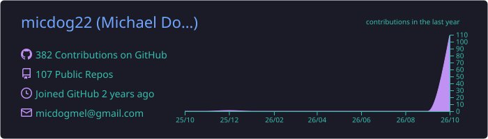
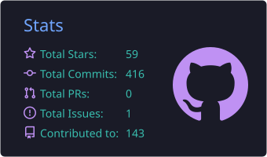
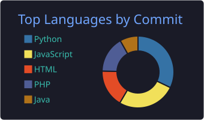

<!--
  Banners em assets/ ficam hospedados no próprio repo: não dependem de API externa,
  então não caem nem estouram limite. A animação roda dentro do SVG, sem JavaScript.
-->

  

  

<!-- O logo do LinkedIn saiu do simple-icons (base do shields.io), por isso vai embutido como data URI. -->

  
  
  
  

## Sobre mim

Desenvolvedor full-stack que gosta de pegar uma ideia e entregar produto rodando em produção: arquitetura, código, deploy e observabilidade. Transito entre o baixo nível no Windows, com drivers, spoofer e ferramentas em C/C++, e a web, com APIs em Python e painéis em Next.js.

- Fundador da **[Clyver](https://clyver.com.br)** e criador do **[Orcepta](https://orcepta.com)**
- Construindo o **Zero Hero**, um RPG idle para mobile feito em Unity
- Curto integrar sistemas: marketplaces, SEFAZ, gateways de pagamento, WhatsApp e n8n
- Do driver em C++ ao painel em Next.js, sem medo de nenhuma camada

## Projetos

<!-- Grid 2x4: tabela HTML é o único layout em colunas que o GitHub respeita no README. -->
<table>
<tr>
<td width="50%" valign="top">

### [Clyver](https://clyver.com.br)
Plataforma SaaS para quem vende em marketplaces: anúncios, estoque, preços, campanhas e atendimento unificado com IA. Conecta Mercado Livre, Shopee, Magalu, TikTok Shop, Shopify, Nuvemshop e WooCommerce.

   

</td>
<td width="50%" valign="top">

### [Orcepta](https://orcepta.com)
Autenticação e licenciamento para software: gera e valida chaves, trava por HWID e IP, bane quem abusa e dá a cada dev um painel multi-tenant para vender acesso aos seus apps.

   

</td>
</tr>
<tr>
<td width="50%" valign="top">

### [Giff Tech](https://gifftech.com)
Infraestrutura white label de crédito para FIDCs: a carga em trânsito (HBL) vira garantia para financiar importadores, com controle do pedido à liquidação.

   

</td>
<td width="50%" valign="top">

### [PALUMI](https://palumi.com.br)
Aprenda idiomas conversando por voz com tutores de IA que corrigem na hora. São 14 idiomas e tutores com sotaque e personalidade próprios, no celular e no navegador.

   

</td>
</tr>
<tr>
<td width="50%" valign="top">

### [Data Reset](https://assine.datareset.com.br)
Assinatura de remoção digital: consulta grátis do que aparece sobre nome, CPF ou CNPJ no Google, JusBrasil e Escavador, com acompanhamento de cada remoção pelo painel.

  

</td>
<td width="50%" valign="top">

### [micdog.cloud](https://micdog.cloud)
Meu template de projetos com animação 3D rodando direto no navegador.

  

</td>
</tr>
<tr>
<td width="50%" valign="top">

### [REMAVE](https://remave.com.br)
EZ ERP de uma rede de peças e cronotacógrafos para caminhões: NF-e e NFC-e na SEFAZ, ordens de serviço, estoque, financeiro e módulo fiscal de ST.

   

</td>
<td width="50%" valign="top">

### Zero Hero
RPG idle/clicker 2D para Android e iOS: mineradores de diamante, heróis com upgrade, batalhas automáticas e chefão a cada 10 fases.

   

</td>
</tr>
</table>

**Mais coisas que já fiz**

- **KeyAdmin:** plataforma de licenças e ativação para software, com bots de Discord para gerenciar chaves
- **Ferramentas Windows:** spoofer, otimizadores, drivers e loaders em C/C++ e C#
- **Jogos no Roblox:** Crashle e Soccer Cards, em Luau

## O que eu faço

- **Windows e baixo nível:** drivers e utilitários em C/C++, WMI/WinHTTP, loaders e automações
- **Performance:** spoofer e otimizadores com foco em jogos
- **Segurança e licenciamento:** Orcepta, KeyAdmin/KeyAuth, HWID e proteção anti-abuso
- **Web e SaaS:** APIs REST, multi-tenant, billing, filas, webhooks, 2FA e dashboards
- **E-commerce:** conectores com marketplaces (OAuth, tokens, anúncios, estoque e mensagens)
- **Fintech:** crédito estruturado e controle de garantias para FIDCs
- **ERP e fiscal:** NF-e, NFC-e, SEFAZ, ordens de serviço e EFD/SPED
- **IA:** tutores por voz, geração de conteúdo e análises com LLMs
- **Automação:** n8n, bots de WhatsApp e Discord, PM2, systemd e CI/CD
- **Games e 3D:** Unity, Roblox (Luau) e animações 3D na web

## Stack

<!-- Uma linha por área. Para mudar, edite a lista "i=" de cada URL; IDs válidos em skillicons.dev -->

**Linguagens** 

**Front-end e design** 

**Back-end e APIs** 

**Bancos de dados** 

**Infra, DevOps e ferramentas** 

**Games e 3D** 

## GitHub

<!-- Cards já gerados neste repo (pasta profile-summary-card-output), no tema tokyonight, igual ao banner. -->

  

  
  

<!-- Cobrinha gerada por .github/workflows/snake.yml no branch output. Sem esse workflow, as imagens dão 404. -->

  <picture>
    <source media="(prefers-color-scheme: dark)" srcset="https://raw.githubusercontent.com/micdog22/micdog22/output/snake-dark.svg" />
    <source media="(prefers-color-scheme: light)" srcset="https://raw.githubusercontent.com/micdog22/micdog22/output/snake-light.svg" />
    
  </picture>

  Curtiu algum projeto? Me chama no <a href="https://www.linkedin.com/in/michael-douglas-091b21334/">LinkedIn</a> ou no <a href="mailto:micdogmel@gmail.com">e-mail</a>.

  

